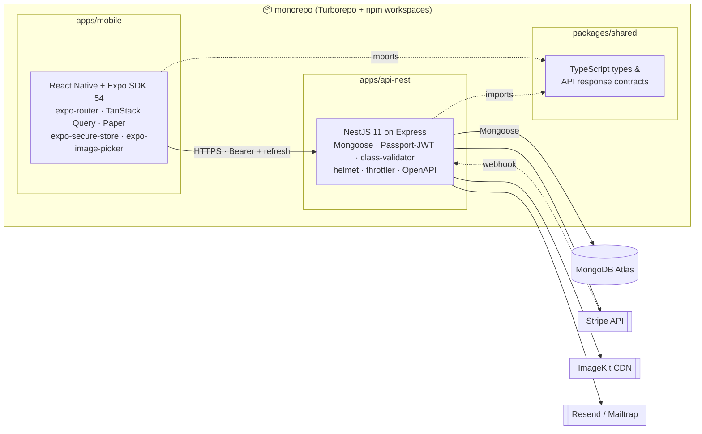

<p align="center">
  
</p>

<h1 align="center">Natours</h1>

<p align="center">
  Full-stack tour-booking platform — a NestJS REST API, a React Native (Expo) mobile app, and shared TypeScript contracts, all in one monorepo.
</p>

<p align="center">
  
  
  
  
  
  
  
  
</p>

---

## What this is

Natours started its life as a server-rendered Express + Pug app (the "Jonas Schmedtmann course" project). This repo is what it became after a complete rebuild:

- the **legacy Express app** is preserved in `apps/api` as a reference,
- a **NestJS API** in `apps/api-nest` replaced it module-by-module,
- a **React Native + Expo mobile app** in `apps/mobile` consumes that API,
- **shared TypeScript types & API contracts** live in `packages/shared`.

> The full transformation (Express MVC → NestJS, refresh-token auth, ImageKit storage, Stripe checkout, the mobile app, cursor pagination, OpenAPI…) is broken into phases — see **[The journey](#the-journey)** at the bottom.

## Highlights

- 📱 **Real iOS / Android app** (Expo SDK 54, React Native 0.81) consuming a typed Nest backend
- 🔐 **Refresh-token auth** with **rotation + reuse detection** (opaque tokens, hashed in Mongo, `expo-secure-store` on the device)
- 💳 **Stripe Checkout** end-to-end — webhook on the backend creates the booking row, mobile jumps back to the Bookings tab
- ⭐ **Reviews** carousel + 5-star picker; ratings recalculated on every create/update/delete
- 🖼 **ImageKit** image storage (Sharp resize on upload), tour gallery with snap-to-card scrolling and pagination dots
- 📧 **Resend / Mailtrap** transactional email (welcome, password reset)
- 🗺 **Tour-detail map** with start + waypoints
- 📚 **OpenAPI / Swagger UI** at `/docs` — interactive contract
- 🔁 **Cursor pagination** for infinite scroll
- 🛡 **Helmet · CORS · rate-limit** (Nest), DTO validation pipe globally

## Screenshots

> _Drop screenshots into `docs/screenshots/` and update the paths below._

| Tours | Tour detail | Bookings | Profile |
| :---: | :---------: | :------: | :-----: |
|  |  |  |  |

## Architecture



## Repo layout

```
.
├── apps/
│   ├── api/                # Legacy Express + Pug (reference, parked)
│   ├── api-nest/           # 🎯 Production API — NestJS 11 + Mongoose
│   └── mobile/             # 📱 React Native + Expo
├── packages/
│   └── shared/             # @natours/shared — TS contracts (envelope, domain, auth)
├── CUTOVER.md              # Express → NestJS go-live checklist (Render + Stripe)
└── turbo.json              # Turborepo pipeline
```

## Tech stack

| Layer | Tech |
|---|---|
| **API** | NestJS 11, Express, Mongoose 8, MongoDB Atlas, Passport-JWT, class-validator, helmet, @nestjs/throttler, @nestjs/swagger, Stripe SDK, ImageKit, Nodemailer, Sharp |
| **Mobile** | Expo SDK 54, React Native 0.81, expo-router, React Native Paper, TanStack Query v5, axios, expo-secure-store, expo-image, expo-image-picker, expo-web-browser, react-native-maps, @expo/vector-icons |
| **Shared** | TypeScript (strict), one shared package for response envelope + domain types + auth payloads |
| **Tooling** | Turborepo, npm workspaces, ESLint, Prettier |

## Getting started

```bash
# 1. install everything (workspaces)
npm install

# 2. fill envs
cp apps/api-nest/.env.example   apps/api-nest/.env
cp apps/mobile/.env.example     apps/mobile/.env

# 3. build the shared package
npm run build

# 4. run the API
npm run dev --workspace=@natours/api-nest

# 5. run the mobile app (separate terminal)
npm run start --workspace=@natours/mobile
# scan the QR with Expo Go
```

**Required env vars (api-nest):** `DATABASE`, `JWT_SECRET`, `JWT_EXPIRES_IN`, `REFRESH_TOKEN_EXPIRES_DAYS`, `STRIPE_SECRET_KEY`, `STRIPE_WEBHOOK_SECRET`, SMTP (`SMTP_HOST/PORT/USER/PASS/EMAIL_FROM`) for prod or `EMAIL_*` (Mailtrap) for dev, `IMAGEKIT_PUBLIC_KEY/PRIVATE_KEY/URL_ENDPOINT`, optional `CORS_ORIGIN`.

**Required env vars (mobile):** `EXPO_PUBLIC_API_URL` (your machine's LAN IP for dev, e.g. `http://192.168.1.10:4000/api/v1` — phones can't reach your `localhost`).

## API documentation

Interactive Swagger UI at `http://localhost:4000/docs` once the API is running. Bearer auth is wired in — click **Authorize**, paste a JWT, try any guarded endpoint.

Domain tags: `auth`, `users`, `tours`, `reviews`, `bookings`.

## Deployment

See **[`CUTOVER.md`](./CUTOVER.md)** for the full go-live checklist:

- Render service settings (Root Directory → `apps/api-nest`)
- Required env vars on Render
- Stripe webhook URL change (`/api/v1/bookings/webhook-checkout`)
- Post-deploy verification
- Retiring `apps/api` (the legacy Express app)

## The journey

1. **Phase 0 — Stabilise.** Fixed 8 real bugs in the Express app (broken filtering regex, header typo, rate-limiter `windowMs`, validator key, Stripe webhook swallowing errors, …). Standardised the response envelope `{ status, results?, data }`. Fixed `server.js` to listen only after a successful DB connect.
2. **Phase 1 — Monorepo + TS.** Restructured into npm workspaces + Turborepo. Moved the Express app into `apps/api`. Created `packages/shared` with strict TypeScript.
3. **Phase 2 — NestJS rewrite (parallel).** Built `apps/api-nest` from scratch alongside Express, porting feature-by-feature: tours → users/auth → reviews → bookings (Stripe webhook with raw-body verification) → mailer. Same Mongoose schemas, same Mongo data.
4. **Phase 3 — Mobile-ready hardening.** helmet + CORS + `@nestjs/throttler`; **ImageKit + Sharp** for cloud image storage; **refresh-token auth** with rotation & reuse-detection; **OpenAPI / Swagger** at `/docs`; **cursor pagination** on `GET /tours`; cutover plan documented.
5. **Phase 4 — React Native / Expo app.** Auth flow with auto-refresh-on-401 axios client; tours list & detail (map, gallery with pagination dots, reviews carousel); booking via Stripe Checkout in an in-app browser; "My Bookings" with "Write a review" dialog (hidden once the user has reviewed that tour); photo upload to ImageKit from the profile screen; branded headers with the Natours logo.

---

<p align="center">
  <sub>Built as a deep-dive portfolio project. The Express app is preserved in <code>apps/api</code> for reference; the production target is <code>apps/api-nest</code> + <code>apps/mobile</code>.</sub>
</p>
